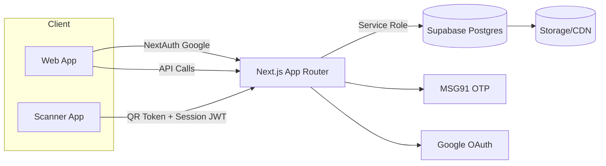
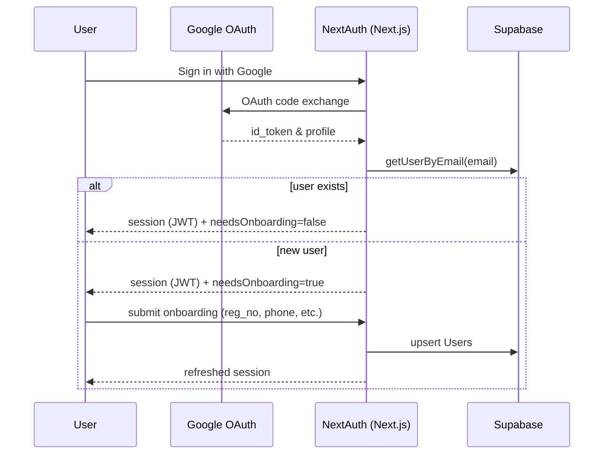
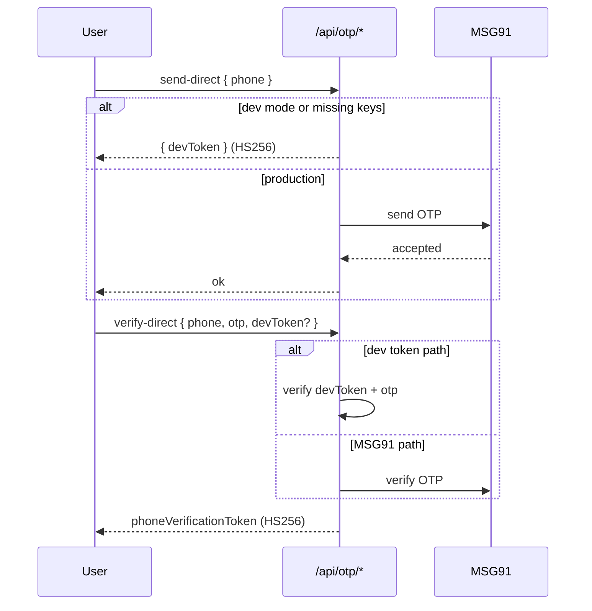
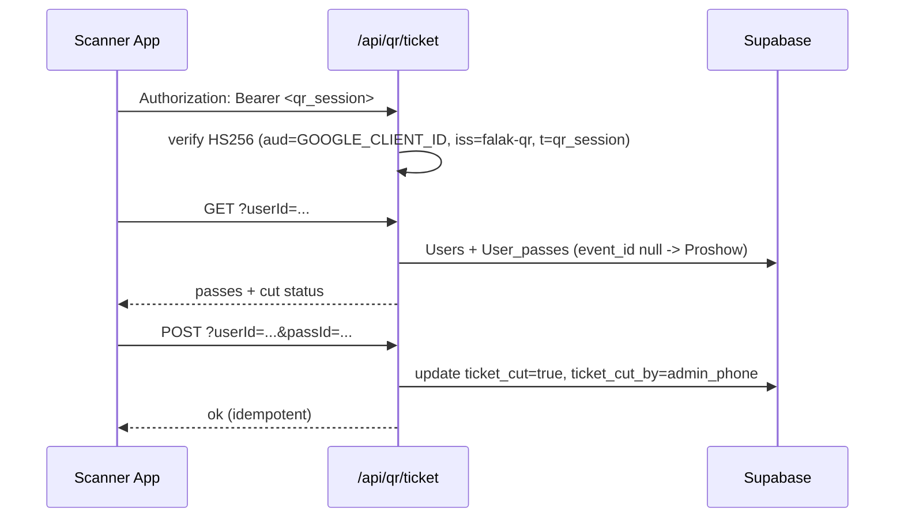
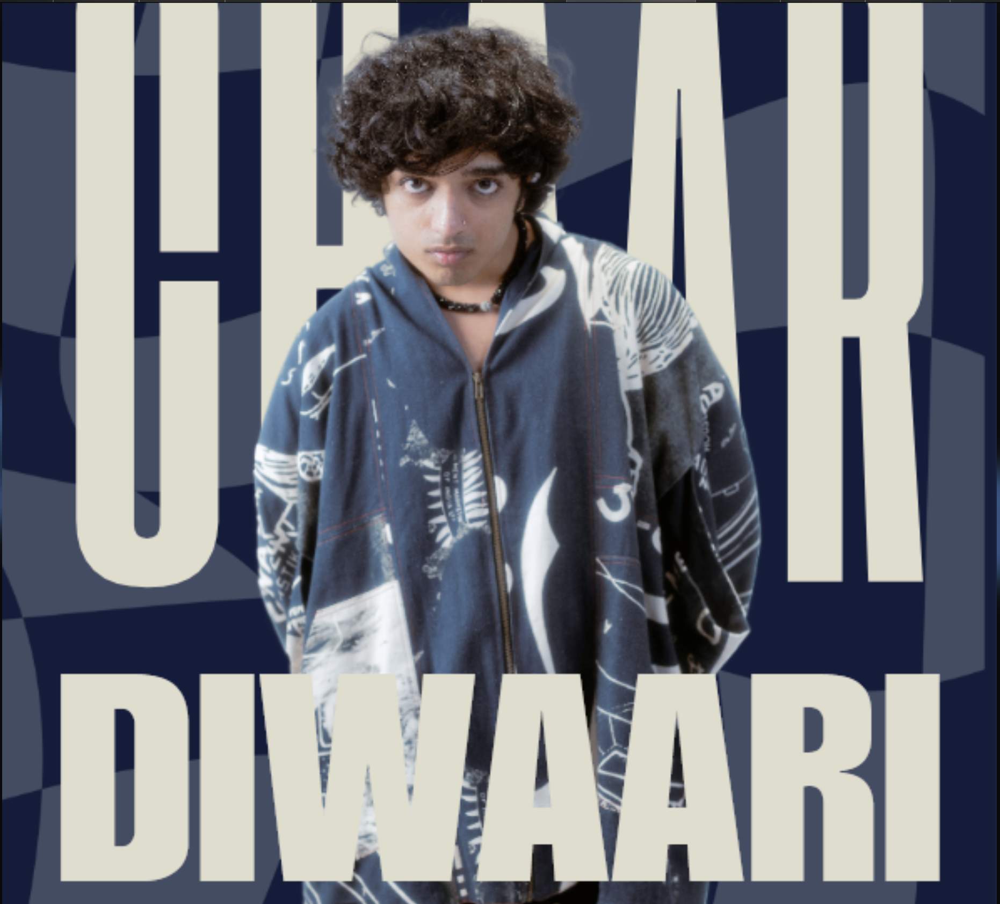

<div align="center">

# FALAK’25 — MIT BLR Cultural Fest Web App

High-performance, full‑stack event platform for registrations, passes, team management, QR ticket verification, and admin ops — built on Next.js App Router + Supabase.

<br />
</div>

<b>At a glance</b>

- 51K visitors in a month
- 7K registered users
- 5.5K passes sold
- 2K+ team registrations
- Survived a coordinated DDoS attempt during peak traffic


---

## Contents

- What’s inside
- Features and dashboards
- Architecture and services
- Data model (ER diagram)
- Verification and auth flows (diagrams)
- API surface (summary)
- Screens and pages (with placeholders for screenshots)
- Local development setup
- Operational scripts and maintenance
- Troubleshooting
- Contributing

---

## What’s inside

- Next.js 15 App Router, React 19, TypeScript, Tailwind CSS 4
- Supabase (Postgres, Auth) as the primary backend
- NextAuth.js (Google OAuth) for user authentication
- OTP verification with MSG91 (with dev-mode fallback)
- Ticketing and QR scanning with secure short‑lived session tokens
- GSAP/Framer animations and modern UI components

Key folders:
- `src/app/*` — App Router pages and API routes
- `src/components/*` — UI components, admin panels, animations
- `src/lib/*` — data access, auth, security, OTP, validation, utilities
- `public/*` — static assets (images, fonts, media)
- `scripts/*` — one‑off maintenance and operational utilities

---

## Features and dashboards

User-facing
- Landing experience with animated hero and themed visuals
- Onboarding with MAHE/Non‑MAHE/faculty flows and reg_no validation
- Passes catalog with purchase flow and cart/checkout
- Events directory with categories and detail pages
- Team registration: captain email override and legacy ID fallbacks
- Profile: owned passes, QR code, registered events, teams (robust legacy matching)

Ticketing and verification
- Deterministic per‑user QR tokens (revocable) for scanning
- Secure scanner session tokens (HS256, strict aud/iss, short TTL)
- Proshow ticket cutting (idempotent), admin phone stamping, timestamps
- Standup Show captain-only cutting with dedicated endpoint

Admin and operations
- Admin dashboard (“Manage”) for tickets, users, and passes
- Aggregation endpoints to list holders and accessible events
- Maintenance scripts (e.g., Non‑MAHE proshow alignment)
- Payment logs sync, diagnostics, and mock tools

---

## Architecture and services

- Frontend: Next.js App Router (server actions + RSC), Tailwind CSS, GSAP
- Auth: NextAuth.js with Google OAuth
- Backend: Supabase Postgres + Row Level Security (via service role for server actions)
- OTP: MSG91 (dev-mode HS256 token fallback)
- QR Scanning: HS256 signed session tokens for scanner app; Supabase data fetch on demand

Mermaid system overview



---

## Data model (ER diagram)

Note: Diagram inferred from implementation. We can refine if you provide the exact schema.

```mermaid
erDiagram
	Users ||--o{ User_passes : owns
	Users ||--o{ Team_members : participates
	Users ||--o{ Teams : captains

	Pass ||--o{ User_passes : is_assigned
	Events ||--o{ Pass : includes
	Events ||--o{ Teams : has

	Teams ||--o{ Team_members : includes

	Users ||--o{ payment_logs : generates
	Users ||--o{ standup_cut : marked

	Users {
		uuid id PK
		text email
		text phone
		text reg_no
		bool mahe
		text name
	}
	Pass {
		uuid id PK
		text pass_name
		bool mahe
		uuid event_id FK nullable  // null => proshow bundle
	}
	User_passes {
		uuid id PK
		uuid userId FK
		uuid passId FK
		bool ticket_cut
		text ticket_cut_by
		timestamptz ticket_cut_at
	}
	Events {
		uuid id PK
		text name
		bool enable
	}
	Teams {
		uuid id PK
		uuid eventId FK
		uuid captainId FK
		text name
	}
	Team_members {
		uuid id PK
		uuid teamId FK
		text memberId // may be legacy email/phone/uuid
	}
	payment_logs {
		uuid id PK
		uuid user_id FK
		jsonb raw
		text status
	}
	standup_cut {
		uuid id PK
		uuid userId FK UNIQUE
		bool cut
		text cut_by
	}
```

---

## Verification and auth flows

### 1) User login (Google) and onboarding



### 2) OTP verification (MSG91 or dev mode)



### 3) QR scanning and ticket cutting



---

## API surface (summary)

Auth and OTP
- `POST /api/otp/send-direct` — send OTP (MSG91 or dev token)
- `POST /api/otp/verify-direct` — verify OTP, returns phoneVerificationToken
- `GET/POST /api/auth/[...nextauth]` — NextAuth.js Google provider

Ticketing and scanner
- `GET /api/qr/ticket?userId=...` — user + passes + cut info
- `POST /api/qr/ticket?userId=...&passId?=...` — mark cut; auto-pick proshow pass if passId missing
- `POST /api/qr/ticket/standup_ticket?userId=...` — captain-only standup cut

Users and teams
- `GET /api/users/byEmail?email=...` — lookup user by email
- `GET /api/users/byId?userId=...` — lookup user by id
- `POST /api/teams/create*` — team creation (variants incl. email-as-captain)
- `POST /api/teams/updateWithEmails` — update team by emails

Operations and payments
- `POST /api/payments/sync`, `GET /api/dev/payments/*` — payments utilities
- `GET /api/admin/payment-logs/nonmahe` — admin aggregation for Non‑MAHE
- `GET /api/ops/event/[eventId]` and `*activate/*deactivate/*holders` — event ops

Middleware and gating
- Event gating via `Events.enable` enforced across actions
- Legacy endpoints like `/api/verify_otp` are deprecated

---

## Screens and pages

Public
- `/` — Landing (animated hero)
- `/passes` — Passes catalog
- `/events` + nested category pages — Events discovery
- `/cart`, `/checkout` — Purchase flow

Authenticated
- `/onboarding` — Registration flow (MAHE/Non‑MAHE/Faculty)
- `/profile` — Passes, QR, teams, and events
- `/tickets` — Ticket actions
- `/admin_manage` — Admin dashboards

Screenshots (placeholders — replace with actual captures):

| Page | Preview |
|------|---------|
| Landing |  |
| Passes |  |
| Events |  |
| Profile |  |
| Admin |  |

> Tip: Add real screenshots under `falak_site_main/public/screens/` and update the links above.

---

## Local development setup

Prerequisites
- Node.js 18+ (recommended LTS)
- A Supabase project (or use limited dev mode)

Environment variables (create `falak_site_main/.env.local`):

```
NEXTAUTH_URL=http://localhost:3000
GOOGLE_CLIENT_ID=your-google-client-id
GOOGLE_CLIENT_SECRET=your-google-client-secret

SUPABASE_URL=your-supabase-url
SUPABASE_ANON_KEY=your-supabase-anon-key
SUPABASE_SERVICE_ROLE_KEY=your-supabase-service-role-key

# OTP (production)
MSG91_AUTH_KEY=your-msg91-authkey
MSG91_OTP_TEMPLATE_ID=your-template-id

# OTP (dev fallback)
OTP_JWT_SECRET=dev-secret-for-hs256

# Scanner session tokens
# Routes currently verify HS256 using GOOGLE_CLIENT_SECRET and aud=GOOGLE_CLIENT_ID
# Optional override for audience:
ADMIN_QR_GOOGLE_CLIENT_ID=your-google-client-id

# Optional
QR_SIGNING_SECRET=integrity-hash-secret
PRESENTATION_MODE=false
```

Install and run

```pwsh
cd falak_site_main
npm install
npm run dev
# open http://localhost:3000
```

---

## Operational scripts and maintenance

Non‑MAHE Proshow alignment

```
npm run fix:non-mahe-proshow
```

Options:
- `DRY_RUN=1` — log-only (no writes)
- `TARGET_PASS_NAME="Non-MAHE BLR"` — disambiguate pass name

What it does
- Scans `payment_logs` for successful Non‑MAHE payments
- Loads `User_passes` proshow rows (where `event_id IS NULL`)
- Ensures Non‑MAHE users hold the correct proshow pass; updates or deletes duplicates

---

## Troubleshooting

Fetch failed in maintenance script
- Ensure `SUPABASE_URL` and `SUPABASE_SERVICE_ROLE_KEY` are set (the script requires service role)
- On Windows PowerShell, export for the current process and run:

```pwsh
$env:SUPABASE_URL="https://YOUR-PROJECT.supabase.co"
$env:SUPABASE_SERVICE_ROLE_KEY="eyJ..."
cd falak_site_main
npm run fix:non-mahe-proshow
```

Missing Authorization in scanner APIs
- The scanner must include `Authorization: Bearer <qr_session>` where the token is HS256‑signed and includes `aud=GOOGLE_CLIENT_ID`, `iss=falak-qr`, and `t=qr_session`.

OTP dev mode
- If MSG91 keys are unset and `NODE_ENV !== production`, the API generates a `devToken` and logs a dev OTP; use it with `/api/otp/verify-direct`.

---

## Contributing

We welcome improvements! Quick guide:

1) Environment
- Duplicate `.env.local` from the example above and fill required keys

2) Install & run
- `npm i && npm run dev`

3) Code style
- TypeScript strictness; Tailwind utility-first
- Lint with `npm run lint`

4) Tests and checks
- Prefer adding minimal tests for critical logic (validation, actions)

5) Pull requests
- Include context of the change, screenshots for UI, and any migration notes

---

## Acknowledgements

- MIT BLR community and contributors
- Supabase, Next.js, NextAuth, MSG91, GSAP, Tailwind ecosystems

